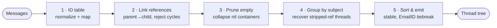
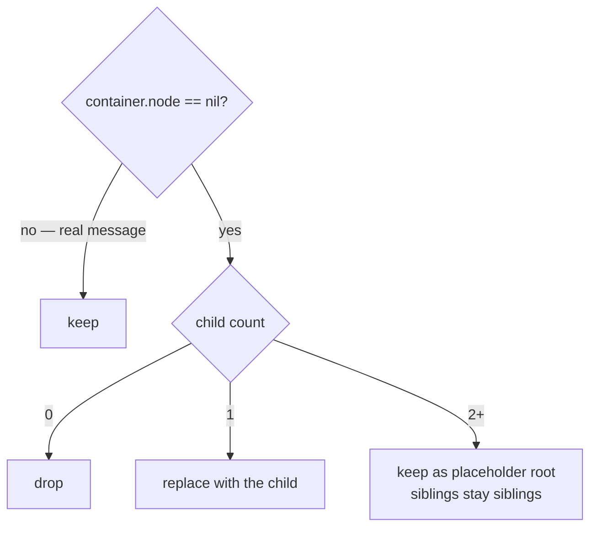

# Algorithm

`jwz-go` follows the algorithm described in [Jamie Zawinski's
threading.html](https://www.jwz.org/doc/threading.html). The five-step
pipeline below mirrors `Build` line-for-line.

## 1. Build the ID table

Every `Message-ID` and every `References` / `In-Reply-To` ID is normalized
(angle brackets stripped, lowercased, whitespace trimmed) and lookup'd in
an ID → `container` map. Missing IDs get empty placeholder containers.

If two messages share the same `Message-ID`, the second is reattached
under a synthetic `Message-ID#email:<EmailID>` key so it doesn't clobber
the first.

## 2. Link references

For each header, the `References` list is walked left-to-right. Every
consecutive pair `(prev, refc)` is linked parent→child. The message's own
container is then attached to whichever parent the header indicates:

- `In-Reply-To` wins if present.
- Otherwise, the last entry in `References`.

`link` rejects edges that would create a cycle (the child already has
`parent` set, or the proposed parent is reachable from the child).

## 3. Prune empty containers

Walked depth-first. A container with `node == nil` is collapsed:

- **0 children** → dropped.
- **1 child** → replaced by that child (the container disappears).
- **2+ children** → kept as a placeholder root, so siblings stay siblings.

Containers with a real message are always kept.

## 4. Group by subject

Roots that share a `CanonicalSubject` are merged under the earliest such
root. This recovers threads where intermediate MTAs stripped references —
common with old mailing-list software, forwarded chains, and clients that
don't follow RFC 5322.

## 5. Sort and emit

Children are sorted by `Date` (stable, with `EmailID` tiebreak). Threads
are sorted newest-first by `LatestAt` (stable, with smallest `EmailID`
tiebreak). The container tree is then converted to a `Thread` /
`ThreadNode` tree, walking once to aggregate `Count`, `LatestAt`,
`Subject`, and `Senders`.

> [!NOTE]
> The whole pipeline is O(n log n) in the worst case (sorting dominates),
> with O(n) total allocations for containers and final tree nodes.

## Complexity

- **Time:** O(n log n) dominated by sort.
- **Space:** O(n) containers + O(n) tree nodes.
- **Determinism:** every step uses stable sorts and lexicographic
  tiebreaks on `EmailID`, so two runs over the same input return
  byte-identical trees.
