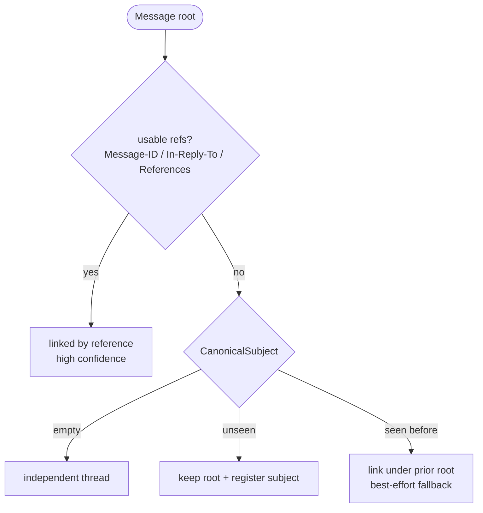

# Subject Grouping

When a message arrives with no usable references (`Message-ID`,
`In-Reply-To`, and `References` all missing or unmatched), jwz-go falls
back to grouping by canonical subject. This recovers threads where
intermediate MTAs or mailing-list software stripped headers.



## Canonical form

`CanonicalSubject` lowercases the subject and repeatedly strips a small
set of locale-aware reply/forward prefixes until none remain:

```go
jwz.CanonicalSubject("Re: AW: SV: Release plan") // "release plan"
jwz.CanonicalSubject("Fwd: FW: Re: report")      // "report"
jwz.CanonicalSubject("  Hello  ")                // "hello"
```

## Recognized prefixes

| Prefix | Language |
|--------|----------|
| `Re:`   | English (reply) |
| `Fwd:`, `Fw:` | English (forward) |
| `AW:`, `WG:`  | German (Antwort, Weitergeleitet) |
| `Tr:`         | French (Transféré) |
| `Reé:`, `Resp:` | Portuguese / Spanish (Resposta / Respuesta) |
| `SV:`, `VS:`  | Swedish / Norwegian / Danish (Svar / Videresendt) |
| `RV:`         | Spanish (Reenvío) |
| `ENC:`        | Portuguese (Encaminhada) |
| `Antw:`       | Dutch (Antwoord) |
| `Odp:`        | Polish (Odpowiedź) |
| `R:`, `I:`    | Italian (Risposta / Inoltro) |

> [!TIP]
> Need a missing locale? Open an issue with the prefix, the language, and
> a sample subject — adding one is a one-line change to `subject.go`.

## Grouping rules

After all reference-based linking is done, the remaining roots are walked
in input order. Each root's first message contributes a canonical
subject. If a prior root already used that subject, the new root is
linked under it. Otherwise, the new root is kept and registered.

Empty subjects are not grouped — they stay as independent threads.

## Why grouping happens *after* references

Reference-based linking is high-confidence: those headers are explicit
about the parent. Subject grouping is best-effort and produces false
positives whenever two unrelated messages share a generic subject
("Question", "Quick update"). Running reference linking first means most
real chains are already collapsed before subject grouping runs, so the
fallback only kicks in for the genuinely orphan tail.
